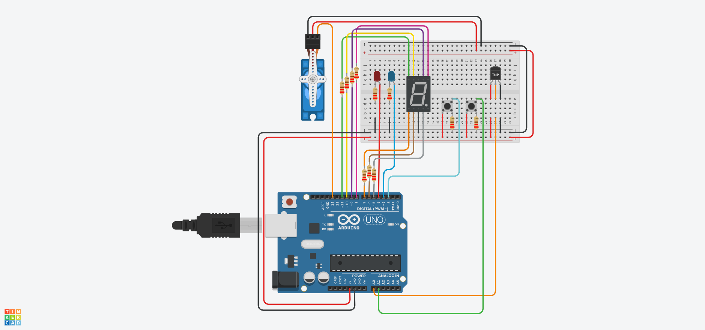
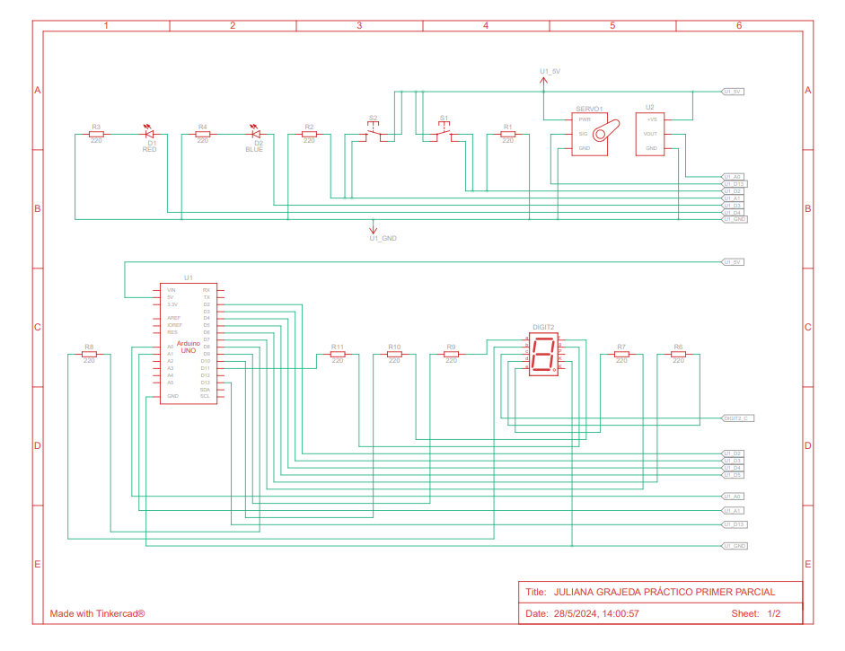
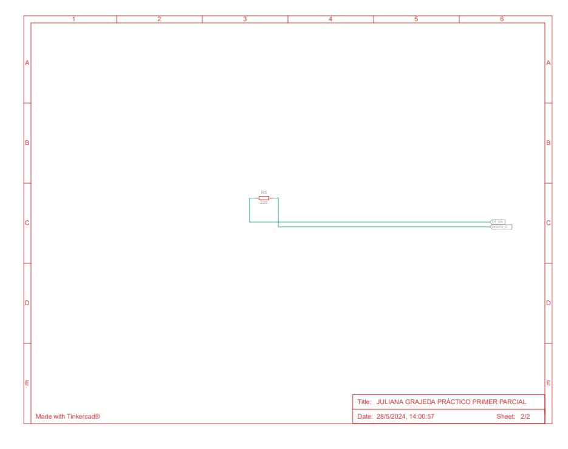

# Práctico Primer Parcial de SPD

## Integrantes
- Juliana Gimena Grajeda

## Proyecto: Alarma de Incendios

### Descripción del Proyecto..
Este proyecto cumple con el objetivo y/o necesidad de realizar un código que proporcione la funcionalidad de una alarma de incendios activable por un sensor de temperatura ambiente y la temperatura promedio en la cual se considera que podría haber un incendio. El mismo incluye un display led de 7 segmentos que muestra la temeperatura categorizada por niveles del 1 al 9, siendo el 6 el promedio de un incendio.
Además de contar de una "llave de agua" la cual se abre si detecta un incendio, cuenta también con dos leds que se encienden en un patrón de tiempo y colores simulando una sirena o alarma.

## Función Principal

### Descripción detallada..
La función principal de mi código es **loop**, ya que en ella se ejecutan el resto de las funciones necesarias para mantener un funcionamiento constante de cada instrucción dada. En loop se llaman a funciones específicas encargadas de realizar cada punto necesario para que este código funcione como una alarma de incendios:

1. **categorizar_temperatura**: Esta función toma como parámetro la temperatura leída y mapeada del sensor, categorizando este valor en niveles según la temperatura promedio en la que se podría considerar un incendio. La función retorna un valor entero que representa el nivel de temperatura ambiente. Además, muestra el nivel actual en el display de 7 segmentos.

2. **manejar_botones**: Esta función se encarga de gestionar el uso de los botones. Lee los valores que estos devuelven al ser presionados y muestra en el monitor en serie si la "alarma" está encendida o apagada. También actualiza la variable bandera_alarma para controlar el estado de la alarma.

3. **encender_alarma** y **apagar_leds**: Estas funciones se encargan de encender y apagar los LEDs en una secuencia de encendido y apagado para simular una sirena de incendios. Si el nivel de temperatura es mayor o igual a 6, se activa la alarma visual con los LEDs y se mueve el servomotor a 90 grados para simular la activación de una válvula de agua. Si el nivel es menor, se apaga la alarma y se devuelve el servomotor a su posición inicial.

4. **avisar_leds**: Esta función parpadea todas las líneas del display de 7 segmentos, proporcionando una indicación visual adicional cuando el nivel de alarma es alto.

_Gracias a estas funciones, el código se puede leer de forma más ordenada, separando en módulos instrucciones que, aunque podrían estar agrupadas en un mismo módulo, ayudan a que otros que lean este código comprendan su funcionamiento de manera más llevadera._

~~~ C
void loop()
{
  lecturaDelSensor = analogRead(A0);
  temperatura = map(lecturaDelSensor,20,358,-40,125);
  int nivel = categorizar_temperatura(temperatura);
  manejar_botones(nivel); 
  
  if (bandera_alarma)
  {
    encender_alarma(nivel);
  }
  else
  {
    apagar_leds();
  }
}
~~~

## Diagrama de Conexiones del Proyecto

## Link al Proyecto
- [Click aquí para ser dirigido al proyecto](https://www.tinkercad.com/things/gUTzVkEOkP6-practico-primer-parcial/editel?sharecode=pjgnvAwwcNJcBiWY2Rh3e7YFxJmLNvZ8M6qPUQ6q05s)

